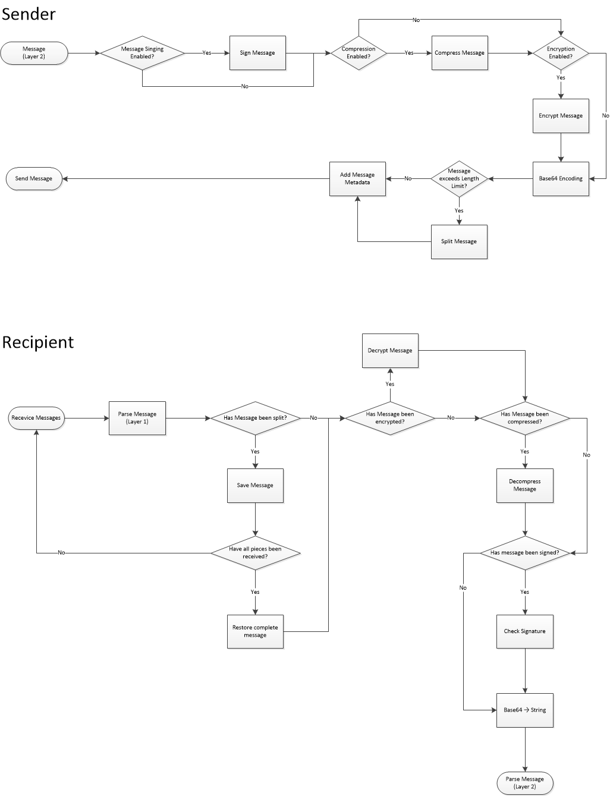

Communication Protocol
======================

Introduction
-------------
The protocol used by wolpertinger consists of 2 layers: 'Transmission Layer' and 'Message Layer'.

The Message Layer specifies high-level constructs for remote method calls and is based on XML.
The Transmission Layer is responsible for the transmission of these xml messages and handles encryption, compression etc.

Wolpertinger was buildt with communication via XMPP in mind, but of course other messaging protocols could be used instead as there is no dependency on XMPP anywhere in the protocol.

 

 
 

Transmission Layer (Layer 1)
-----------------------

### Overview 

The transmission layer handles the transmission and processing of messages from the message layer. 

####Message Metadata
The Transmission layer adds metadata to the actual message being sent, which is required by the message's recipient to parse the message.
Metadata is stored in a simple key-value format. A colon separates key and value, a semicolon indicates the end of a key-value pair, so a valid metadate will always looks like this:

		<KEY>:<VALUE>;

All of a message's key-value pairs are added in front of the actual message-payload.

####Payload
Layer 1 will always treat the message's payload as binary-data. How this byte-data is interpreted by the layers above is of no concern to layer 1.

**The message's payload is always base64-encoded**

####Message Id and Delivery Confirmation
Every message gets assigned a message id by the sender. The id is a unsigned 32-bit integer value and needs to be unique per session (the sender might just use a message counter). 

Integer overflows can be handled by just resetting the counter to 0. (It is highly unlikely that the number of messages that are processed at the same time exceeds 2^32)

-	Key: <code>message_id</code>
-	Value - the message's identifier 

**Note: The message_id field is mandatory**

After a client has received a message, it must confirm that the message has been received. (No matter how the message is processed after that).  
To do that it just needs to send a message in this format
	
		result:<RESULTCODE>;message_id:<MESSAGE_ID>;

to the sender.

If no error occurred, set RESULTCODE to 0, otherwise return a error-code

####Compression

To save bandwidth, messages can be compressed using GZip. If this is the case, a metadata field is added that specifies the length of the message's payload **after compression** in bytes. This is necessary, because AES encryption might add padding at the end of the data (AES uses a fixed block size) which would make it impossible to decompress otherwise.

-	Key: 'gzip'
-	Value: Length of the data in bytes after compression

		gzip:LENGTH;

####Singing

*To be specified*

####Encryption

The encryption field indicates that the message has been encrypted and specifies the encryption algorithm used.

At the moment, only AES is supported.

-	Key: <code>encryption</code>
-	Value: <code>aes</code>

		encryption:aes;

####Message Splitting
A message might be too long to be sent in one piece. In this case, the message's payload is split. All Metadata is added to **all** message pieces. 
Additionally more metadata fields are added to the message.

-	Fragment Index
	-	Key: <code>fragment_index</code>
	-	Value: The fragment's index in the message (first fragment has index 0)
-	Fragment Count
	-	Key: <code>fragment_count</code>
	-	Value: The total number of pieces the message has been split into

These fields can also be added if the message has not been split (fragment\_index=0, fragment_count=1) but can be omitted in this case.

The delivery confirmation has to be sent only once for a split message, once the message has been received completely.

###Examples

-	compressed and encrypted, but unsigned and non-split message

		message_id:1;encryption:aes;gzip:50;xdzBd2ITRH5uk00xz7sdPC4n4JFDKEFlAyyyeWO4WObAux4iRMi5MoQD

-	signed, encrypted and compressed message

		signature:HvEjPJcGxW2K7K5;encryption:aes;gzip:50;xdzBd2ITRH5uk00xz7sdPC4n4JFDKEFlAyyyeWO4WObAux4iRMi5MoQD

-	3rd fragment of a message split into 5 pieces

	  	message_id:8;fragment_count:5;fragment_index:2;secure:aes;xdzBd2ITRH5uk00xz7sdPC4n4JFDKEFlAyyyeWO4WObAux4iRMi5MoQD0JjrIAuZfICybbvtbJyaW3M2YMobtjtmcRSd+/hmbq4MQFepeuMgGPziBeor0k+BiOhVgtK65xldhK/3IGITP8M4StE8OGPFUfNObBQO57FHHMQEOvcUlg9TPU0KRx7WrnrHvEjPJcGxW2K7K5pDEkRMuANeDsTMI/SBqPrW+wqUd/3ZRysod/bbCUt+UWWq1ECsI/c8beF+1+1hUDX0G2mBX5rPcacsZJAAMm7vld4qKDFjPjj07uP9eY0uS1Cq5+7i/

 
 
 

Message Layer (Layer 2)
--------------

There are only 3 types of messages that can be exchanged between wolpertinger clients: RemoteMethodCall, RemoteMethodResponse and RemoteError. The message format is XML based and thus should be straightforward to implement.

###Message Types

All messages may contain any Unicode character, as long as they are valid XML.
Furthermore, all messages need to conform to the [Protocol XML Schema](xsd/protocol.xsd). Messages that cannot be validated should not be processed any further and the recipient should respond with a RemoteError (Error-Code 301).

All messages have a 'ComponentName' property that specifies the component the request will be passed to. There is no component hierarchy, so components cannot contain "child"-components.

####RemoteMethodCall
A RemoteMethodCall, as the name indicates, invokes a procedure on the target system. The caller needs to specify the method's name and all required parameters.
For every call the caller needs to specify a unique CallId value. This Id will be sent with the response, so the caller can associate response messages to method calls.

Responses are not mandatory and the callee may offer methods without response value.

#####Elements
-	<code>ComponentName: String</code> - the name of the component that offers the method
-	<code>MethodName: String</code> - the name of the method to be invoked
-	<code>CallId: String</code> - The call's unique identifier
-	<code>Parameters : List < Object ></code> - the parameters the method requires

#####Example
	<RemoteMethodCall>
		<ComponentName>Core</ComponentName>
		<CallId>F5AFEC97-5839-4666-B8D3-8C108B241720</CallId>
		<MethodName>testMethod1</MethodName>
		<Parameters>
			<object type="string">This is a string-example</object>        
			<object type="boolean">true</object>        
		</Parameters>    
	</RemoteMethodCall>

####RemoteMethodResponse
If a method returns a value, it will be sent back to the caller using a RemoteMethodResponse

#####Elements
-	<code>ComponentName : String</code> - the name of the component that handled the RemoteMethodCall
-	<code>CallId : String</code> - the unique identifier of the method call that produced the response
-	<code>ResponseValue : Object</code>- the value returned by the method

#####Example
	<RemoteMethodResponse>
		<ComponentName>Core</ComponentName>
		<CallId>F5AFEC97-5839-4666-B8D3-8C108B241720</CallId>
		<ResponseValue>
			<object type="boolean">true</object>
		</ResponseValue>
	</RemoteMethodResponse>

####RemoteError
This message-type can be used to notify other clients about errors that occurred. Errors can be both asynchronous (not caused by the error's recipient) and synchronous (error occurred because the error's recipient called a method).

In case of a synchronous error, the CallId of the method call that caused the error will be specified in the RemoteError's CallId property. Otherwise this element will be omitted.

#####Elements
-	<code>ComponentName : String</code> - the name of the component that caused the error
-	<code>ErrorCode : Int32</code> - the error-code specifying the kind of error that occurred. A list of all specified error codes can be found [here](MISSINGLINK)
-	<code>CallId : String</code>  *(optional)* - the CallId of the method call that triggered the error in case of a synchronous error

#####Example
	<RemoteError>
		<ComponentName>Core</ComponentName>    
		<ErrorCode>1</ErrorCode>
		<CallId>F5AFEC97-5839-4666-B8D3-8C108B241720</CallId>
	</RemoteError>

 
 
 

Connection Timeouts
--------------------
Timeouts can occur on both layers of the protocol. Errors in layer 1 always cause errors in layer 2, but not the other way round.

###Layer 1

In the transport layer, a timeout occurs if a client fails to confirm the delivery of a message within the timeout interval. In that case, the sender may try to send the message again.

If message delivery fails repeatedly it can be assumed that the recipient is no longer available. In this case the upper layers should be informed about the error, too.

###Layer 2

In the message layer, RemoteMethodResponse and RemoteError messages do not expect a response from the recipient and thus no layer 2 timeout can occur.

For RemoteMethodCalls messages it depends on whether the call expects response or if the called method has no return value.
If there is no return value expected, the call cannot time out and it can be assumed the action was successful if the recipient confirmed the message's delivery (layer 1) and no RemoteError message has been received.

If a response is expected, timeout handling should be triggered if the callee fails to send the response within the timeout interval after the delivery confirmation or if the callee did not even confirm message delivery.

For the case that the callee needs more time to complete a request it can prevent a layer 2 timeout be calling the <code>Heartbeat</code> method. This will reset timeout and the callee has another interval to respond.

**Layer 1 timeouts cannot be prevented and delivery notifications always need to be sent in time.**
