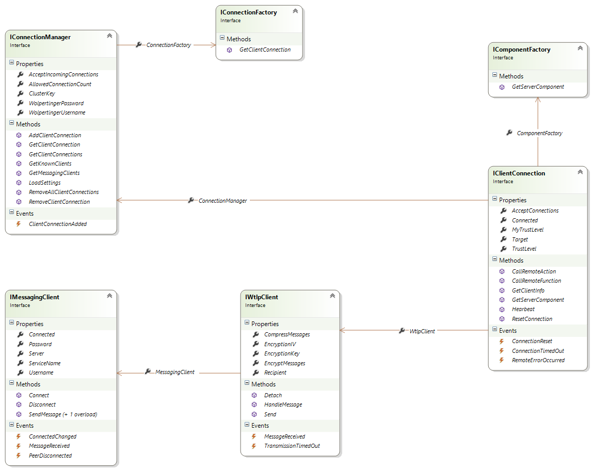

Reference Implementation
================

Architecture Overview 
----------------------

        
As you can see in the above diagram, the implementation consists of 5 main components. All of theses components are loosly coupled. 
They interact exclusively via Interfaces and thus can be exchanged easily.

-	**ConnectionManager (<code>IConnectionManager</code>)** handles all incoming and outgoing communication.  It is used to send and receive messages, manages all the ClientConnections and is used to store data relevant to all other components</li>
            
-	**ComponentFactory (<code>IComponentFactory</code>)** is used by ConnectionManager to instantiate new ClientConnections and by ClientConnection to get MessageProcessors and Client- and ServerComponents

-	**MessageProcessor (<code>IMessageProcessor</code>)** handles the conversion between raw-text messages and instances of the wolpertinger messages are implemted in. This includes (de)serialization, encryption, compression and message singing.
            
-	**ClientConnection (<code>IClientConnection</code>)** represents a connection to a single wolpertinger client. It handles incoming messages passed to it by the connection mananager and passes them to the correct Client- or ServerComponent. Furthermore it  provides features to ease the implementation of components.
            
-	**Components (<code>IComponent</code>)**
Components are where remote methods are actually implemented. How exactly this is handled is not specified in the interface and depends on the actual implementation of ClientConnection (a ComponentFactory should be used to get components, so it is more dependent on the factory used) and the components. This is described in the paragraph "Default Implementations".  
There are three types of components
	-	**ClientComponents** Are used to send RemoteMethodCalls and receive answers to the calls
	-	**ServerComponents** Are used to respond to incoming RemoteMethodCalls
	-	**ClientServerComponents** are components that act as both client- and server-component

Default Implementations
--------------------------

###DefaultConnectionManager
implements <code>IConnectionManager</code>
    
Default implementation of a ConnectionManager. It uses XMPP to send and receive messages and is buildt using the agsXMPP library.

Its main job is to delegate incoming messages to the appropriate ClientConnections and keep track of them.

###DefaultComponentFactory
implements <code>IComponentFactory</code>

Component factories are used to instanziate components for making and responding to RemoteMethodCalls.

When the application starts, DefaultComponentFactory loads all types from all loaded assemblies that implement the <code>IComponent</code> interface. For every one of these types it checks the <code>ComponentAttribute</code> attribute and reads out the TargetName of messages the component handles. It also determines whether the component is a client-, server- or client-server-component and saves them accordingly in a Dictionary. When a component for a certain target name is requested, it will look up the required type in the dictionary and return a new instance of that type.
    
    
###DefaultMessageProcessor
implements <code>IMessageProcessor</code>

Message processor used by ClientConnection to deserialize and serialize Messages from and to XML.
    
This implementation supports message encryption, compression and singing.

###DefaultClientConnection
implements <code>IClientConnection</code>

DefaultClientConnection uses an instance of <code>DefaultComponentFactory</code> to initialize components and tries to handle incoming messages accordingly.
Once a component has been initialized, it will be kept alive for future use, so that components do not need to be stateless and can save temporary data in local variables.
    
It uses a <code>IMessageProcessor</code> to serialize and deserialize Messages.

To determine which methods to call in a component when a RemoteMethodCall or -Reponse is received, it relies on Refelection. 
ClientConnection also enforces the security policy and checks for every method call, if the calling client is permitted to invoke that method or not.

For details on the security model, see [Authentication](authentication-process)

Implementing Components
----------------------------

###Client Components
To make a class a ClientComponent, it needs to implement the <code>IComponent</code> interface. The interface has, at least at the moment only one member <code>ClientConnection</code> of the type <code>IClientConnection</code>. This property will automatically be set by the ClientConnection that hosts the component and can be used to interact with the connection.

To make a RemoteMethodCall the component needs to initialize a new instance of RemoteMethodCall, specify all its properties and pass it to the connections <code>SendMessage()</code> method which will make a asynchronous call.
Alternatively the RemoteMethodCall can be passed to <code>GetReponseValueBlocking()</code>. This will make the calling thread block until a response to that call is received and return the received value.

This should only be called if the called method has a return value, otherwise the connection will time out and <code>GetReponseValueBlocking()</code> will return a TimeoutException object.

For asynchronous calls a ClientComponent can specify response-handler methods that will be invoked once a response to a asynchronous call has been received. There are some restriction on the signature of these methods. For starters it may <b>not</b> have a return value and must be <code>void</code>. Furthermore the method can only have one parameter which's type must be compatible to the type of the value returned by the RemoteMethodCall.

To make a method a response handler and to specify which responses it handles, the RemoteMethod's name needs to be specfied using the <code>ResponseHandlerAttribute</code> attribute. Response handlers are identified solely using this attribute, so the method's name does not have to follow any naming conventions (although following general conventions of your programming language is of course advisable)

To make implementation of ClientComponents easier, they can inherit from the abstract <code>ClientComponent</code> class from the wolpertinger core assembly which provides a implementation of <code>IComponent</code> and other functionality useful for the implementation of such components.
    
####Sample
This is a sample of a very simple client-component implemented using the ClientComponent class, which provides methods to call the "Test" RemoteMethod both synchronously and asynchonously.

It includes a response handler method for the asynchronous call

	[Component("Sample", ComponentType.Client)]
	public class ClientInfoClientComponent : ClientComponent
	{
    		public event EventHandler<ObjectEventArgs<string>> TestCompleted;
        
    		//Calls the remote method "Test" synchronously
    		public string Test()
    		{
        		return (ClientInfo)callRemoteMethod("Test");
    		}

		//Calls the remote method "Test" asychronously
    		public void TestAsync()
		{
        		callRemoteMethodAsync("Test" ,true);
    		}

    		//Handles the response to the remote method "Test" and raises the TestCompleted event
    		[ResponseHandler("Test")]
    		protected void responseHandlerTest(string value)
    		{
        		if (TestCompleted != null)           
            		TestCompleted(this, new ObjectEventArgs<string>(value));        
    		}
	}
    

###Server Components    
A server-componets is simpler to implement than a client-component.

Just like a client-component it needs to implement the <code>IComponet</code> interface to be able to interact with the hosting ClientConnection.
For the class there also needs to be specified a ComponentAttribute attribute so that the component factory can associate the component to a target name.
For every remote method the component wants to handle, it needs to specify one method that returns a <code>CallResult</code>. The parameters of the method need to match the number, order and type of the RemoteMethod as they will be passed to the method "as they come in" by the ClientConnection.
        
The method can then return one of the following sub-classes of <code>CallResult</code>
-	**ResponseResult** to make ClientConnection respond to the method call with the specified value
-	**VoidResult** to make ClientConnection do nothing
-	**ErrorResult** to make ClientConnection send the calling client a RemoteError
        
In order to determine which method handles which RemoteMethodCall, each method has to specify the RemoteMethod's name using the <code>MethodCallHandlerAttribute</code> attribute. 
Which method is called is determined solely by this attribute, so the methods name does not have to follow any naming conventions.

Every method should also specify the trust level a client needs to be allowed to call the method. This can be done using the <code>TrustLevelAttribute</code> attribute.

If no trust level is specified, <code>TrustLevel.MAX</code> will be assumed which will fail in most cases.

####Sample
This is a sample of a very simple server-component with only one method. The componet handles method calls with the target-name "Sample"
        
	[Component("Sample", ComponentType.Server)]
	public class SampleServerComponent : IComponent
	{
    		[MethodCallHandler("Test"), TrustLevel(2)]
    		public CallResult Test()
    		{
        		return new ResponseResult("This is the string the method returns");
			}

    		//ClientConnection as defined in IComponent
    		public IClientConnection ClientConnection { get; set; }

	}
   

###ClientServerComponets
ClientServerComponents are just components that serve as both client- and server-components. This fact is refelected in their implementation. 
To make a class a ClientServerComponent, it of course needs to implement <code>IComponent</code>. In the compoent-attribute the component-type "ClientServer" has to be specified.

The rest of the implemenattion does not differ. Just implement your client logic as you would do in a ClientComponent and implement your server-logic as you would do in a ServerComponent.
    
####Sample
This sample shows how to combine the client and server parts of the above samples into a single class. 

Most of the work had already been done when implementing the client component. All there was to to was to change the component-type to "ClientServer" and insert the <code>Test()</code> method from the server component. 

The method had to be renamed in order to avoid naming conflicts.

	[Component("Sample", ComponentType.ClientServer)]
	public class ClientInfoClientComponent : ClientComponent
	{
    		//## Client implementation

    		public event EventHandler> TestCompleted;
        
    		//Calls the remote method "Test" synchronously
    		public string Test()
    		{
        		return (ClientInfo)callRemoteMethod("Test");
    		}

    		//Calls the remote method "Test" asychronously
    		public void TestAsync()
    		{
        		callRemoteMethodAsync("Test" ,true);
    		}

    		//Handles the response to the remote method "Test" and raises the TestCompleted event
    		[ResponseHandler("Test")]
    		protected void responseHandlerTest(string value)
    		{
        		if (TestCompleted != null)           
            		TestCompleted(this, new ObjectEventArgs(value));        
    		}
    
    
    		//## Server implementation
    
    		[MethodCallHandler("Test"), TrustLevel(2)]
    		public CallResult Test_server()
    		{
        		return new ResponseResult("This is the string the method returns");
    		}
	}

